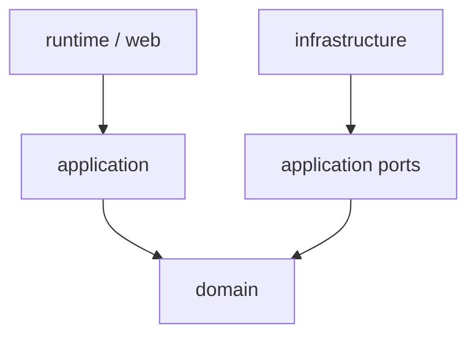
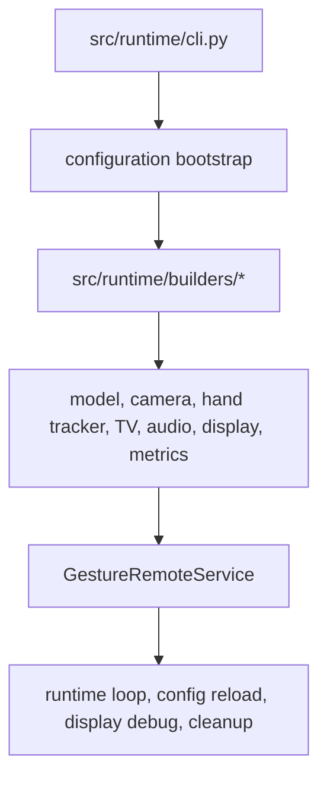

# Architecture

Gesture TV Remote uses a lightweight Clean Architecture / Ports and Adapters
layout. The codebase stays small, but the dependency direction is explicit:
domain rules are pure, application use cases depend on ports, infrastructure
implements those ports, and runtime wires concrete objects together.



Runtime and web are entry points. Application owns use cases and ports. Domain
owns gesture rules. Infrastructure owns concrete libraries, devices, network
protocols, and storage.

## Repository Structure

```text
src/
├── domain/
│   ├── session/
│   ├── evaluators/
│   ├── gestures/
│   ├── geometry/
│   ├── commands/
│   └── constants.py
├── application/
│   ├── ports/
│   ├── pipelines/
│   └── services/
├── infrastructure/
├── runtime/
├── shared/
└── web/
```

### `src/domain`

Responsibility:

- `session/`: gesture session lifecycle, session state, decision result types,
  and debug snapshot/rendering values
- `evaluators/`: phase and motion decision engines used by the session
- `gestures/`: activation tracking, pose classification, gesture history,
  preprocessing, motion filtering, and joystick-style motion state
- `geometry/`: pure camera crop, landmark, and projection math
- `commands/`: command mappings and command-transition decisions
- `constants.py`: shared gesture and TV command names

Allowed dependencies:

- Python standard library
- other domain modules
- small shared configuration value objects when needed by existing domain rules

Do not put here:

- OpenCV, MediaPipe, TV SDK, audio, storage, network, runtime, or web imports
- process orchestration
- adapter selection
- persistence or configuration loading

### `src/application`

Responsibility:

- use cases and orchestration
- application services
- runtime pipelines
- ports that describe external boundaries
- application-level command dispatch and metrics

Allowed dependencies:

- `src/domain`
- `src/application/ports`
- small shared value objects such as `AppConfig`

Do not put here:

- OpenCV, MediaPipe, TV SDK, audio, SQLite, mDNS, or web framework imports
- construction of concrete infrastructure adapters
- gesture business rules that can be deterministic domain logic

### `src/infrastructure`

Responsibility:

- MediaPipe hand tracking and model storage
- OpenCV frame capture, preprocessing, display rendering, and overlays
- TV adapters and protocol-specific command translation
- SQLite-backed config persistence
- mDNS publishing
- microphone and voice-stream integration

Allowed dependencies:

- `src/application/ports`
- `src/domain`
- concrete third-party libraries and hardware/network integrations
- `src/shared` value objects and logging

Do not put here:

- runtime process composition
- HTTP route handling
- gesture decisions or activation rules

### `src/runtime`

Responsibility:

- CLI runtime selection
- configuration bootstrap
- dependency wiring in focused `src/runtime/builders/` modules and final
  composition in `src/runtime/container.py`
- construction of concrete infrastructure adapters
- returning fully constructed application/runtime objects

Allowed dependencies:

- application, infrastructure, web, shared config, and logging

Do not put here:

- gesture decisions
- adapter protocol behavior
- HTTP request handling
- reusable business logic

### `src/web`

Responsibility:

- settings UI
- browser gesture capture UI and signaling endpoints
- direct remote UI and command endpoints
- HTTP endpoints
- form parsing
- Jinja template rendering
- shared dark app shell, navigation, and static assets

Allowed dependencies:

- application-facing config ports
- web-local protocols for application services
- shared config values
- web-local rendering and form helpers
- Jinja template primitives

Do not put here:

- direct infrastructure construction
- gesture logic
- runtime process orchestration

The web UI uses server-rendered Jinja templates with a shared `base.html` layout
and plain page-specific JavaScript. Feature route registration lives beside each
web feature, such as `src/web/gesture/app.py`, `src/web/remote/app.py`, and the
settings modules under `src/web/settings/`; `src/web/app.py` composes those
feature routes into the unified aiohttp app. Prefer extending the shared layout
and `static/app.css` over adding standalone HTML documents or page-specific
visual systems. Static assets are served from `/static/` by the aiohttp app; the
settings-only server serves the same shared stylesheet for local configuration
workflows.

### `src/shared`

Responsibility:

- small cross-cutting primitives such as configuration and logging

Do not put here:

- broad utility collections
- business rules
- infrastructure adapters

## Architecture Principles

### Domain

Domain code must remain framework-independent. It contains gesture state,
classification, activation, motion filtering, gesture decisions, and command
mapping. It must not import infrastructure or runtime code.

New domain code should follow the existing package boundaries:

- session lifecycle, state, result types, or debug snapshots -> `src/domain/session/`
- session phase or motion evaluators -> `src/domain/evaluators/`
- gesture classification, preprocessing, history, or motion state -> `src/domain/gestures/`
- camera or landmark math -> `src/domain/geometry/`
- command mappings or command-decision rules -> `src/domain/commands/`

### Application

Application code contains use cases, orchestration, pipelines, ports, and
application services. It depends on domain and application ports. It does not
construct infrastructure directly; concrete collaborators are passed through
constructors.

### Infrastructure

Infrastructure implements application ports with concrete integrations:
MediaPipe, OpenCV, TV adapters, SQLite storage, mDNS, and audio. Infrastructure
may translate between third-party APIs and application/domain types, but it must
not own gesture business rules.

Browser media receivers are infrastructure adapters too: they feed decoded
browser video into `FrameSourcePort` and browser microphone chunks into the voice
capture boundary while backend application and domain code keep owning gesture
and command behavior. Local media receivers use the same ports for the webcam and
microphone attached to the Python host.

The web app runtime serves settings, browser gestures, and the direct remote
from one origin. Camera and microphone access from that `.local` origin requires
HTTPS with a certificate trusted by the browser.

### Runtime

Runtime is the composition root. It reads configuration, creates concrete
infrastructure implementations, prepares required runtime resources, and wires
application services explicitly through focused `src/runtime/builders/` modules
composed by `src/runtime/container.py`.

### Web

Web is an external adapter for user interaction. It provides the local
configuration UI and HTTP endpoints, using application-facing ports for saved
configuration.

## Ports and Adapters

Ports isolate application logic from concrete infrastructure. They live in
`src/application/ports/` and are defined with `typing.Protocol` so adapters can
use structural typing instead of inheriting from heavy abstract base classes.

Current examples include:

- `TVRemotePort`
- `HandTrackerPort`
- `FrameSourcePort`
- `FrameProcessorPort`
- `DisplayPort`
- `VoiceCapturePort`
- `ConfigProviderPort`
- `ConfigStorePort`

Infrastructure adapters satisfy these contracts structurally. For example,
MediaPipe tracking implements `HandTrackerPort`, OpenCV frame capture implements
`FrameSourcePort`, TV clients implement `TVRemotePort`, and the SQLite config
repository implements `ConfigStorePort`.

Use a port when application code needs a replaceable external boundary. Do not
create interfaces for small pure-domain helpers or objects that are not
meaningful external boundaries.

## Runtime Flow

The CLI in `src/runtime/cli.py` selects the unified web app runtime, local
gesture runtime, or settings-only runtime.
Runtime builder modules build the concrete object graph:



1. load environment and saved configuration
2. create config repositories and providers
3. prepare the MediaPipe model file before constructing the hand tracker
4. create TV, camera, display, hand-tracking, audio, metrics, and command
   dispatcher adapters
5. inject those collaborators into `GestureRemoteService`

`GestureRemoteService` then owns the gesture runtime lifecycle: connect, verify
the webcam, run the gesture loop, and clean up. Focused application
coordinators under `src/application/services/coordinators/` handle live config
reload, the runtime frame loop, display/debug rendering, and cleanup sequencing.

See `docs/runtime-pipeline.md` for runtime pipeline and concurrency details.

## Boundary Enforcement

Architecture tests in `tests/architecture/test_layer_boundaries.py` scan imports
and fail when forbidden layer dependencies are introduced. They also reject
dynamic import escape hatches in domain and application code.

The rest of the test suite mirrors the production layers: `tests/domain/`,
`tests/application/`, `tests/infrastructure/`, `tests/runtime/`, `tests/web/`,
and `tests/shared/`. Shared fakes and helpers live under `tests/fakes/` and
`tests/helpers/`.

## Design Rules

- Prefer domain functions for deterministic gesture rules.
- Keep I/O and third-party libraries behind infrastructure adapters.
- Add orchestration in application only when it represents a use case workflow.
- Wire dependencies explicitly in focused `src/runtime/builders/` modules and
  keep `src/runtime/container.py` limited to whole-service composition.
- Use constructor injection and `Protocol` ports; do not add a DI framework.
- Keep `main.py` and `src/runtime` free of business logic.
- Add tests around domain behavior before changing gesture semantics.
- Add or update layer-boundary tests when changing dependency rules.
