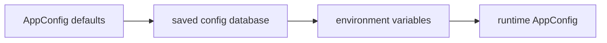

# Configuration

Runtime defaults live in `src/shared/config.py` as `AppConfig`. `AppConfig` is
grouped into `tv`, `gesture`, `camera`, `model`, `web`, `debug`, and
`performance` sections so runtime code reads related settings together. The
application loads those defaults, applies saved configuration from the local
config database when present, and then applies environment-variable overrides
at startup.

Current runtime defaults:

- TV adapter: `samsung`
- TV host: `192.168.8.7`
- config database file: `data/gesture_tv_remote.sqlite3`
- webcam index: `0`
- model file: `models/hand_landmarker.task`
- Android TV cert file: `certs/android/cert.pem`
- Android TV key file: `certs/android/key.pem`
- Apple TV pyatv storage file: `certs/appletv/pyatv.json`
- Wake-on-LAN: disabled until the app discovers and stores the TV MAC address

## Pairing Credentials

Pairing credentials are stored in `certs/`. They are ignored by git because
they identify paired TV sessions.

On first Android TV pairing, `androidtvremote2` generates:

- `certs/android/cert.pem`
- `certs/android/key.pem`

Samsung tokens are stored in `certs/samsung/token.txt` by default. webOS client
keys are stored in `certs/webos/client_key.txt` by default. Apple TV credentials
are read from pyatv storage at `certs/appletv/pyatv.json` by default.

Do not commit those files.

## TV Adapters

Set `GESTURE_TV_ADAPTER` to select the TV integration:

| Value | Library | Notes |
| --- | --- | --- |
| `androidtv` | `androidtvremote2` | Supports pairing, TV commands, remote microphone streaming, and foreground app voice input. |
| `samsung` | `samsungtvws` | Supports TV commands. Accept the pairing prompt on the TV when required. |
| `webos` | `aiowebostv` | Supports TV commands. Accept the pairing prompt on the TV when required. |
| `roku` | `rokuecp` | Supports ECP TV commands. |
| `appletv` | `pyatv` | Supports Apple TV remote commands using paired pyatv credentials. |

Apple TV pairing is handled with pyatv tooling before starting this app:

```bash
uv run atvremote --storage-filename certs/appletv/pyatv.json wizard
```

Use the same storage file in `GESTURE_TV_APPLETV_STORAGE_FILE` if you choose a
non-default location.

## Wake Before Connect

The app can send Wake-on-LAN packets before connecting to adapters that support
network wake. Wake starts disabled by default because it requires the TV network
MAC address. After a successful normal connection, the app attempts to read the
local neighbor/ARP table for the configured `tv_host`. When it finds a valid MAC
address, it saves `tv_mac_address` and enables `tv_wake_enabled` for future
launches.

Wake behavior is best-effort and depends on TV settings and the local network.
Every adapter can send a generic Wake-on-LAN magic packet once `tv_mac_address`
is known, but automatic MAC discovery varies by platform. Android TV can learn a
MAC from its pairing certificate, Roku can learn the active network MAC from ECP
device info, and Apple TV can learn a MAC from pyatv scan metadata when
available. Samsung exposes a Wi-Fi MAC through device info; the app stores it as
a Wake-on-LAN candidate even when the TV reports wired networking because that
is the only MAC Samsung exposes through the current REST endpoint. LG webOS can
use Wake-on-LAN when a MAC is known; the app tries webOS connection-manager and
system payloads after pairing, but LG does not expose a reliable public
MAC-address API across all webOS TV models.

Local neighbor/ARP discovery only works when the TV is on the same layer-2
network as the machine running Python. If the TV is reached through a router,
mesh segment, VPN, container bridge, or WSL NAT, the local neighbor table usually
contains the router or virtual gateway MAC instead of the TV MAC.

If automatic discovery cannot find the MAC address, set `tv_mac_address`
manually in settings or with `GESTURE_TV_MAC_ADDRESS`. Once the MAC is known,
`tv_wake_enabled` can remain enabled so startup sends wake packets, retries
connection for `tv_wake_connect_timeout_seconds`, and then continues only after
the TV accepts the adapter connection.

Holding the active hand in a two-finger pose for about one second starts the
configured TV/global voice target. The default `voice_input_target=auto` uses
Android TV remote microphone search when available, then falls back to an
adapter's native voice UI. Foreground app voice input is separate: on Android
TV, microphone capture starts only after the foreground app requests a voice
session through the Android TV Remote Protocol. The app does not press a
focused on-screen mic gesture before voice capture.

Use `voice_input_target=remote_search` for Android TV remote microphone search,
or `voice_input_target=native_search` to ask adapters such as Roku and Samsung
to open the TV's native voice UI. Roku and Samsung do not accept this app's
microphone audio through their public remote protocols, and webOS has no public
raw microphone input path in the current adapter.

## Model File

On first run, the app downloads Google's `hand_landmarker.task` model into
`models/`. The file is ignored by git. Downloads use a bounded timeout and
retry count, write to a temporary file first, and atomically replace the final
model file only after a complete download.

## Config Database

The SQLite configuration database defaults to
`data/gesture_tv_remote.sqlite3`. The `data/` directory is ignored by git
because it contains local runtime state.

Startup config precedence is:



1. `AppConfig` defaults
2. saved config from the local database, when present
3. environment variables

`GESTURE_TV_CONFIG_DB` is read during bootstrap to decide which database file to
open, so it can point the app at a different saved configuration store.

The config database and config UI still use the flat setting names shown in the
environment-variable table. Those names are user-facing storage and form fields;
the grouped `AppConfig` sections are the internal runtime structure.

## Settings UI

Run the settings-only UI with:

```bash
uv run python main.py settings
```

It listens on `https://localhost` by default and advertises
`https://gesturetvremote.local` with mDNS when local network discovery is
available. Set `GESTURE_TV_CONFIG_WEB_HOST`,
`GESTURE_TV_CONFIG_WEB_PORT`, `GESTURE_TV_CONFIG_WEB_MDNS_ENABLED`,
`GESTURE_TV_CONFIG_WEB_MDNS_NAME`, and the web TLS variables to override the
bind address, port, mDNS publishing, advertised name, or HTTPS certificate.
Saved settings are persisted to the config database.

The settings page uses top-level tabs for TV, Gesture, Camera, and System
settings. Each tab keeps common controls visible and places less frequently used
controls in an Advanced disclosure section. Fields are marked when they apply
live or require restarting the active runtime. Environment variables still
override saved values shown in the UI.

When a saved change affects restart-required fields, the unified app runtime
shows a restart prompt. Pressing Restart runtime requests a graceful stop of the
active app process. The process exits with code `75`; use a service manager,
script, or shell wrapper to relaunch it when that code is returned. The
settings-only runtime can save the same configuration but cannot restart a
separate gesture/app process.

If `.local` names do not resolve on a device, use `https://localhost` on the
machine running the app or `https://<device-ip>` from another device on the
same network.

When the web port is left at its default `80`, HTTPS runtimes listen on port
`443`. Binding to port `443` may require administrator permissions or a
firewall rule on some systems. Set `GESTURE_TV_CONFIG_WEB_PORT=8443` if port
`443` is unavailable.

## Web App Runtime

Run the unified web app runtime with:

```bash
uv run python main.py app
```

Open `https://gesturetvremote.local/` from the browser capture device. The same
web runtime serves the home hub at `/`, settings at `/settings`, browser
gesture capture at `/gesture`, and the direct remote at `/remote`, so the
configured `.local` name can host the app from one backend server. When the web
port is left at its default `80`, HTTPS web runtimes serve on port `443`; if you
configure another web port, use that port in the URL.

Browsers require a secure context for camera and microphone APIs. `localhost`
counts as secure for local testing. For `.local` access, the web runtimes create
a self-signed certificate and key at `certs/web/server.crt` and
`certs/web/server.key` when they are missing:

```bash
uv run python main.py app
```

The generated certificate must still be trusted by the browser or operating
system on the capture device. Without that trust, the browser may block the page
or camera/microphone access. You can replace the generated files with a trusted
certificate, for example one created with `mkcert`.

If the page reports that media devices are unavailable, check the browser log
entry in `logs/logs.txt`; the client sends its origin, secure-context state, and
user agent to `/api/log/client`.

## Live Reload

The gesture runtime periodically reloads saved config from the local database.
Pure gesture, timing, voice-duration, fixed camera zoom, and auto-zoom tuning
settings apply while the process is running.

Restart the gesture runtime after changing resource or integration settings:

- TV adapter, host, adapter ports, pairing credential paths, or app name
- Wake-on-LAN settings and learned TV MAC address
- webcam index
- model file, model URL, model download settings, or MediaPipe confidence settings
- max tracked hands
- config database path, config UI host/port, or mDNS settings

Environment variables still have the highest precedence. If an environment
variable is set for a live-reloadable field, changing the saved value in the UI
will not override that environment value.

## Environment Variables

| Variable | Default |
| --- | --- |
| `GESTURE_TV_APP_NAME` | `Gesture TV Remote` |
| `GESTURE_TV_CONFIG_DB` | `data/gesture_tv_remote.sqlite3` |
| `GESTURE_TV_CONFIG_WEB_HOST` | `0.0.0.0` |
| `GESTURE_TV_CONFIG_WEB_PORT` | `80` |
| `GESTURE_TV_CONFIG_WEB_MDNS_ENABLED` | `True` |
| `GESTURE_TV_CONFIG_WEB_MDNS_NAME` | `gesturetvremote` |
| `GESTURE_TV_CONFIG_WEB_TLS_ENABLED` | `False` |
| `GESTURE_TV_CONFIG_WEB_TLS_CERT_FILE` | `certs/web/server.crt` |
| `GESTURE_TV_CONFIG_WEB_TLS_KEY_FILE` | `certs/web/server.key` |
| `GESTURE_TV_ADAPTER` | `samsung` |
| `GESTURE_TV_HOST` | `192.168.8.7` |
| `GESTURE_TV_WAKE_ENABLED` | `False` |
| `GESTURE_TV_MAC_ADDRESS` | empty |
| `GESTURE_TV_WAKE_BROADCAST_ADDRESS` | `255.255.255.255` |
| `GESTURE_TV_WAKE_PORT` | `9` |
| `GESTURE_TV_WAKE_PACKET_COUNT` | `3` |
| `GESTURE_TV_WAKE_CONNECT_TIMEOUT_SECONDS` | `20.0` |
| `GESTURE_TV_WAKE_CONNECT_RETRY_SECONDS` | `2.0` |
| `GESTURE_TV_ANDROID_CERT_FILE` | `certs/android/cert.pem` |
| `GESTURE_TV_ANDROID_KEY_FILE` | `certs/android/key.pem` |
| `GESTURE_TV_SAMSUNG_TOKEN_FILE` | `certs/samsung/token.txt` |
| `GESTURE_TV_SAMSUNG_PORT` | `8002` |
| `GESTURE_TV_WEBOS_CLIENT_KEY_FILE` | `certs/webos/client_key.txt` |
| `GESTURE_TV_ROKU_PORT` | `8060` |
| `GESTURE_TV_APPLETV_STORAGE_FILE` | `certs/appletv/pyatv.json` |
| `GESTURE_TV_VOICE_INPUT_TARGET` | `auto` |
| `GESTURE_TV_VOICE_CAPTURE_SECONDS` | `5.0` |
| `GESTURE_TV_MODEL_FILE` | `models/hand_landmarker.task` |
| `GESTURE_TV_MODEL_URL` | MediaPipe hand landmarker URL |
| `GESTURE_TV_MODEL_DOWNLOAD_TIMEOUT_SECONDS` | `20.0` |
| `GESTURE_TV_MODEL_DOWNLOAD_RETRIES` | `2` |
| `GESTURE_TV_WEBCAM_INDEX` | `0` |
| `GESTURE_TV_CAMERA_ZOOM` | `1.0` |
| `GESTURE_TV_AUTO_ZOOM_ENABLED` | `True` |
| `GESTURE_TV_AUTO_ZOOM_MIN` | `1.0` |
| `GESTURE_TV_AUTO_ZOOM_MAX` | `10.0` |
| `GESTURE_TV_AUTO_ZOOM_PADDING` | `0.5` |
| `GESTURE_TV_AUTO_ZOOM_SMOOTHING` | `0.1` |
| `GESTURE_TV_AUTO_ZOOM_POSITION_DEADBAND` | `0.08` |
| `GESTURE_TV_AUTO_ZOOM_SCALE_DEADBAND` | `0.12` |
| `GESTURE_TV_AUTO_ZOOM_CROP_RESET_THRESHOLD` | `0.08` |
| `GESTURE_TV_MAX_HANDS` | `2` |
| `GESTURE_TV_DEBOUNCE_SECONDS` | `0.3` |
| `GESTURE_TV_FIST_HOLD_HOME_SECONDS` | `0.7` |
| `GESTURE_TV_POINTER_SCREEN_RADIUS_RATIO` | `0.14` |
| `GESTURE_TV_POINTER_DOMINANCE` | `1.0` |
| `GESTURE_TV_VOLUME_DISTANCE_RATIO` | `1.0` |
| `GESTURE_TV_VOLUME_MIN_DISTANCE` | `0.06` |
| `GESTURE_TV_VOLUME_MAX_DISTANCE` | `0.16` |
| `GESTURE_TV_PINCH_DISTANCE_RATIO` | `0.22` |
| `GESTURE_TV_REQUIRE_UPRIGHT_HANDS` | `True` |
| `GESTURE_TV_HAND_UPRIGHT_MAX_TILT_RATIO` | `0.75` |
| `GESTURE_TV_VOICE_CAPTURE_SECONDS` | `5.0` |
| `GESTURE_TV_DEBUG_LOG_SECONDS` | `0.5` |
| `GESTURE_TV_VERBOSE_PIPELINE_DIAGNOSTICS` | `False` |
| `GESTURE_TV_METRICS_LOG_SECONDS` | `2.0` |
| `GESTURE_TV_ACTIVE_HAND_LOST_GRACE_SECONDS` | `0.35` |
| `GESTURE_TV_ACTIVE_HAND_MATCH_MAX_DISTANCE` | `0.6` |
| `GESTURE_TV_MIN_HAND_DETECTION_CONFIDENCE` | `0.6` |
| `GESTURE_TV_MIN_HAND_PRESENCE_CONFIDENCE` | `0.6` |
| `GESTURE_TV_MIN_TRACKING_CONFIDENCE` | `0.6` |

Example:

```bash
GESTURE_TV_ADAPTER=samsung GESTURE_TV_HOST=10.0.0.25 GESTURE_TV_WEBCAM_INDEX=1 python main.py
```

The pointer neutral circle is a fixed fraction of the displayed camera crop, so
the yellow circle stays visually stable as auto-zoom widens or tightens the
preview. The first point frame captures the index fingertip as a fixed pointer
center; moving beyond a small activation margin outside that circle emits the
dominant direction. Volume uses a fixed vertical center from the first pinch
contact point between the thumb tip and index fingertip, with its neutral band
scaled from the detected active hand size and clamped by the volume min/max
distance settings. Returning inside the neutral
circle or band re-arms motion without moving the anchor. Holding outside the
activation margin repeats the same command after `GESTURE_TV_DEBOUNCE_SECONDS`;
changing direction requires returning to neutral first.
In the app runtime, the browser reports the rendered preview dimensions so the
backend can keep pointer and volume trigger distances visually consistent on
portrait phones, landscape tablets, and desktop windows.

`GESTURE_TV_CAMERA_ZOOM` is the starting digital center-crop zoom for MediaPipe
hand tracking and display. Values above `1.0` make hands larger in the tracking
input, which can help finger landmark reliability when the camera is far away.
Start with `1.5`; larger values reduce the field of view and can crop out the
active hand during large movements.

Set `GESTURE_TV_AUTO_ZOOM_ENABLED=true` to let the display crop follow the last
detected hand area. Auto zoom uses a wider, slower MediaPipe detection crop and
maps detected landmarks back into original frame coordinates before gesture
decisions run. Navigation and volume distances use the displayed crop for visual
feedback. Auto-zoom targets the active hand's normalized center and size so
clipped or stretched edge landmarks do not prevent zooming to a far-away hand.
When a detected hand reaches the display crop edge, the detection crop stays
wider so MediaPipe can keep tracking while the display remains zoomed in.

Numeric settings are validated at startup. Zoom values must be at least `1.0`,
confidence values must be between `0.0` and `1.0`, max values must not be lower
than their matching min values, and durations, distances, or ratios cannot be
negative.
Boolean settings accept `1`, `true`, `yes`, `on`, `0`, `false`, `no`, and `off`.

`GESTURE_TV_REQUIRE_UPRIGHT_HANDS` and
`GESTURE_TV_HAND_UPRIGHT_MAX_TILT_RATIO` apply to the active hand. This
prevents sideways or upside-down hands from activating gestures or being
misclassified as command gestures.

Gesture sessions start only when two upright open palms are visible. After the
session starts, one hand can leave the frame if the remaining hand is still an
upright open palm; that hand becomes the active controller and pending command
or motion state is cleared. `GESTURE_TV_MAX_HANDS` must be at least `2` so
MediaPipe can report both activation palms.

`GESTURE_TV_ACTIVE_HAND_LOST_GRACE_SECONDS` keeps an active gesture session
alive through brief active-hand detection dropouts. This helps when a hand is
close to a frame or crop edge and MediaPipe occasionally reports zero hands for
a frame or two. During plain active-hand loss, auto-zoom widens back toward the
full frame so the camera can reacquire a hand at the crop edge. Pointer and
volume motion anchors still hold the crop while the session is in dropout grace
so their visual neutral zones stay fixed. Once the active hand is missing longer
than the grace interval, the session deactivates normally.

Set `GESTURE_TV_VERBOSE_PIPELINE_DIAGNOSTICS=true` to log camera FPS, detection
time, gesture decision time, command queue depth, command send latency, dropped
command count, dropped stale frames, active adapter, and the current gesture
decision. The app uses simple internal counters and timers.
`GESTURE_TV_METRICS_LOG_SECONDS` gestures how often those metrics are logged.
