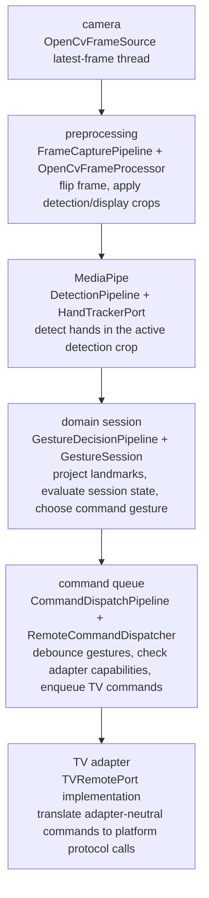

# Runtime Pipeline

The gesture runtime stays concurrent because camera capture, hand detection,
window rendering, and TV network commands run at different speeds.

The optional browser-control runtime keeps the same backend pipeline, but
replaces the local OpenCV camera source with a WebRTC video source from the
browser. The browser only captures media and streams it to Python; MediaPipe hand
tracking, gesture-session evaluation, voice routing, and TV command dispatch
remain backend responsibilities.

In browser-control mode, the same aiohttp web runtime serves the config UI at
`/` and browser capture at `/control`, then advertises the control path with the
configured mDNS name when mDNS is enabled.

## Flow Diagram

Display rendering runs beside the main flow after the domain decision so the
preview can show the same crop, landmarks, and debug state used for decisions.
Voice capture also branches from command dispatch when the microphone gesture is
emitted.

## Pipelines

`GestureRemoteService` is the top-level application orchestrator. Runtime wiring
creates its concrete collaborators in focused `src/runtime/builders/` modules
and injects them through ports:

| Pipeline | Responsibility |
| --- | --- |
| `FrameCapturePipeline` | Starts the latest-frame camera source, flips frames, and applies the current detection/display zoom crops. |
| `DetectionPipeline` | Submits frames to the injected hand-tracker port and records detection timing. |
| `GestureDecisionPipeline` | Projects hand states back from the active detection crop, evaluates the domain session, and updates auto-zoom for the next frame. |
| `CommandDispatchPipeline` | Applies gesture debounce and enqueues adapter-neutral TV commands. |
| `DisplayDebugCoordinator` | Builds/logs display debug messages, draws overlays through the display port, and renders the preview frame. |
| `OpenCvDisplay` | Infrastructure adapter that draws detected hand landmarks and renders the OpenCV preview window. |
| `PipelineMetrics` | Tracks lightweight counters and timings for debug diagnostics. |

Application pipeline implementations live in `src/application/pipelines/`.
OpenCV frame processing, display rendering, MediaPipe tracking, audio capture,
and TV transport live in `src/infrastructure/` behind application ports.
Gesture decisions enter the pure domain through `src/domain/session/`, which
dispatches to focused phase and motion evaluators under `src/domain/evaluators/`.
`GestureRemoteService` remains the lifecycle owner for connection setup,
runtime-loop execution, and final shutdown. Focused application coordinators
under `src/application/services/coordinators/` own live config reload, the
frame-processing loop, display/debug rendering, and cleanup sequencing while
concrete adapter construction stays in the runtime builders.

`src/runtime/builders/camera.py` prepares the MediaPipe model file before
constructing the concrete hand tracker.

## Concurrency Model

Camera capture runs in one dedicated thread. It continuously reads from OpenCV
and stores only the newest frame. The service loop consumes versioned latest
frames; if frame versions jump, older frames are counted as dropped instead of
being processed late.

In browser-control mode, the WebRTC receiver stores only the newest decoded BGR
video frame behind the same `FrameSourcePort`. The service loop treats it like a
local camera source, so stale browser frames are skipped in the same way as stale
webcam frames.

MediaPipe hand tracking runs in live-stream mode behind `HandTrackerPort`. The
runtime submits the current detection frame and consumes the latest completed
result. Auto-zoom uses separate display and detection crops: display follows the
active hand, while detection lags wider so edge hands remain visible to
MediaPipe. Pointer and volume distances are measured against the displayed crop.
Once pointer or volume motion has established an anchor, auto-zoom crop updates
are paused until the anchor clears; this keeps the visual neutral center fixed
during motion and dropout grace.

The preview smooths only the drawn landmark overlay in original-frame
coordinates and holds it briefly through dropped detection frames. Gesture
decisions still use the current MediaPipe result.

Adapter-neutral TV commands are sent by one bounded async dispatcher task. Slow
TV network calls, reconnects, or adapter retries do not block camera capture,
hand detection, gesture decisions, or display rendering.

Samsung and Roku clients use one thread-bound executor each because their
libraries are synchronous. That keeps each TV connection opened, used, retried,
and closed on one worker thread.

Voice input remains adapter-scoped infrastructure. A sustained two-finger
gesture requests the configured TV/global voice target. App voice input streams
microphone audio to a foreground app voice listener only after the adapter sees
an app-requested voice session; Android TV reports this through the Android TV
Remote Protocol. Remote microphone search and native TV voice UI launch are
separate targets because native voice UI paths do not accept this app's
microphone audio.
The microphone audio queue is bounded and drops stale chunks.

Shutdown is delegated to `CleanupCoordinator`. It cancels voice capture, stops
frame capture, closes MediaPipe, releases the camera, closes OpenCV windows,
stops command dispatch, and disconnects the TV adapter.

## Diagnostics

Set `GESTURE_TV_VERBOSE_PIPELINE_DIAGNOSTICS=true` to emit periodic pipeline
metrics in debug logs. `GESTURE_TV_METRICS_LOG_SECONDS` controls the log
interval.

Metrics include:

- camera FPS
- detection time per frame
- gesture decision time
- detection crop mode
- command dispatch queue depth
- command send latency
- dropped command count
- dropped/stale frame count
- active TV adapter
- current gesture decision

The metrics are internal counters and timers. The app does not use a heavy
observability framework.
